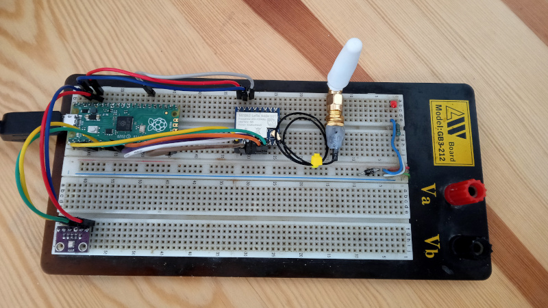

# ohMesh

Tady si schovávám svoje pokusy se sítí Meshtastic. Začal sem s tím někdy začátkem zimy 2024. Zatím mám 1 statickou (ohM1) a jednu mobilní (ohM2) stanici na bázi modulu Heltec V3. Pak jsem postavil ještě jednu tu mobilní pro svého kamaráda. Ta je prakticky shodná s tou mojí.
Na další pokusy mám připravený další modul Heltec V3 (byl v akci) a na breadboardu stanici s Raspberry Pi Pico (ohM3).

# ohM1

Statická stanice na bázi Heltec V3. Navíc má snímač prostředí BME280 a napájecí obvod aby mohla být připojená na 12V.

Zařízení je v provozu od prosince 2024. Mělo to být dočasné řešení, něco jako pokus, ale zatím jsem s tím spokojený.

# ohM2

Mobilní vysílačka na bázi Heltec V3. Navíc má GPS modul, aby mohla reportovat polohu.

Víc podrobností v [adresáři ohm2](https://github.com/ondrejh/ohMesh/tree/master/ohm2#readme)

# ohM3

První stanice s RP2040. Zatím je ve stádiu BreadTastic Pico.

Víc podrobností v [adresáři ohm3](https://github.com/ondrejh/ohMesh/tree/master/ohm3#readme)

## Linky (Zatím netříděné)

[Anténa ohM1 (Aliexpress)](https://www.aliexpress.com/item/1005006833587735.html?spm=a2g0o.order_list.order_list_main.131.3e601802HxDH7p)

[Měření tlaku, vlhkosti a teploty, BME280 (Aliexpress)](https://www.aliexpress.com/item/1005004527984343.html?spm=a2g0o.order_list.order_list_main.106.3e601802HxDH7p)

[Samostatný LoRa module SX1262 (Aliexpress)](https://www.aliexpress.com/item/1005005868418525.html?spm=a2g0o.order_list.order_list_main.59.3e601802HxDH7p)
