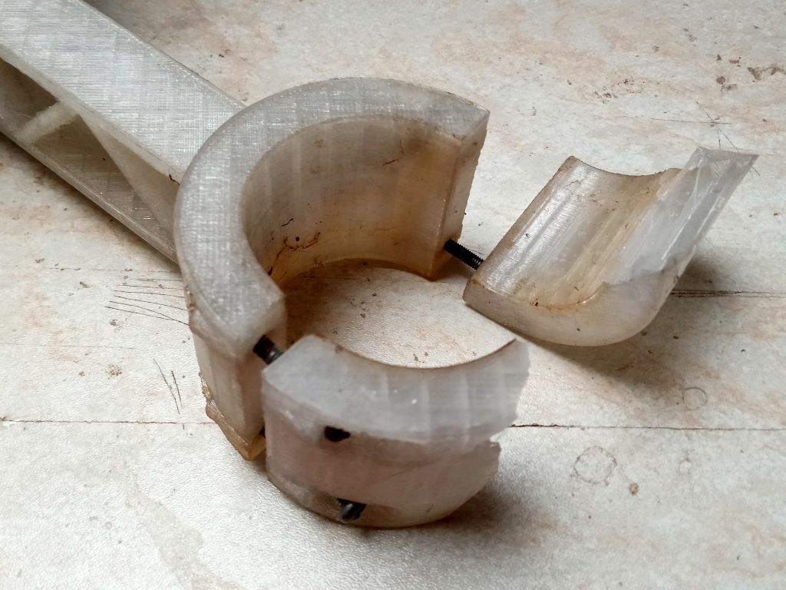
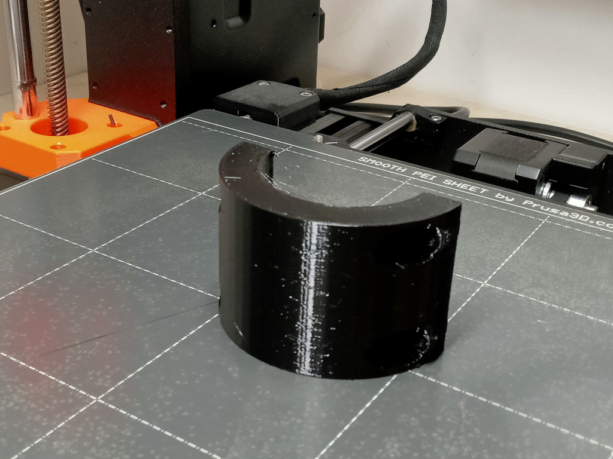
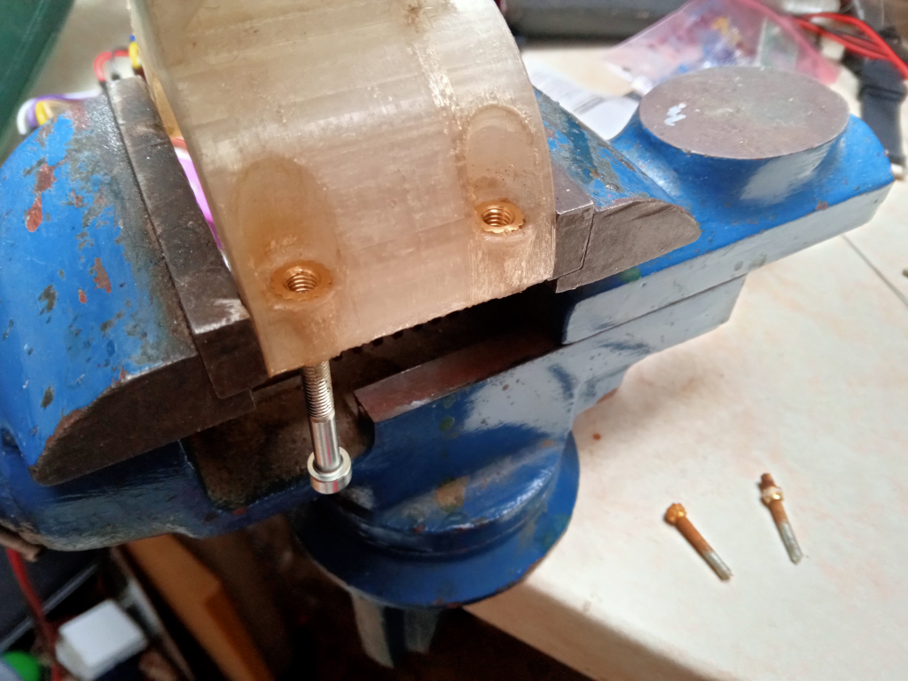
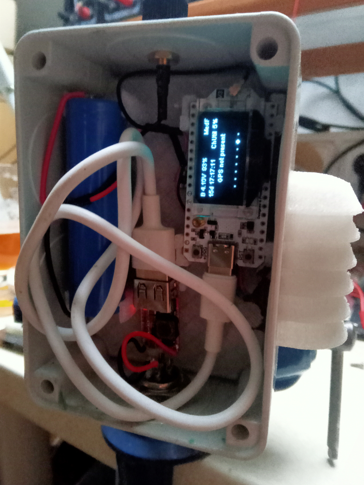
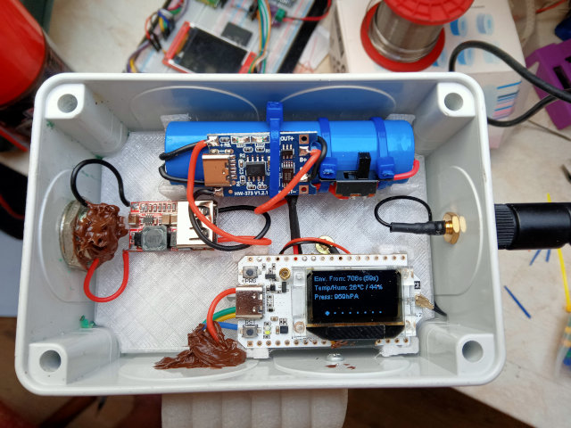

# ohM1

Statická stanice na bázi Heltec V3. Navíc má snímač prostředí BME280 a napájecí obvod aby mohla být připojená na 12V.

Zařízení je v provozu od prosince 2024. Mělo to být dočasné řešení, něco jako pokus, ale zatím jsem s tím spokojený.

# Update a servis po půl roce

Po více jak půl roce provozu jsem se rozhodl updatovat FW. Aktuální verze (červenec 2025) je 2.6.11 a na stanici byl FW 2.5.. Shodou okolností se po vydatné bouřce přestal hlási senzor, takže dolů se menší servis hodí.

Prvním problémem bylo sundání stanice ze střechy. Malinkaté závitové vložky M3 to v kombinaci s rezivými příliš dlouhými šrouby nedaly a až na jednu se protočily. Jiné nářadí než imbus jsem na střeše neměl (typicky), takže jsem držák odpáčil.

Do budoucna by to chtělo něco s pantem na jeden šroub, nejlépe křídlovku. Taky materiál by to chtělo jiný. PETG na sluníčku přece jen dost křehne. No, příště. Teď jsem jen vytisknul novou sponu držáku.

Závitové vložky jsem vytavil ven a nahradil většími M4, které tam snad budou lépe držet.

Také jsem chtěl dát kratší šrouby, aby tolik netrčely a nerezivěly. V dané délce měli "jen" nerez - no paráda, to by mohlo být řešení.

Uvnitř krabice bylo čisto a sucho, až na spodní napájecí konektor. Nenapadlo mě, že bude vlhkost procházet konektorem. Na druhou stranu není vodotěsný - dal jsem tam co jsem měl. Konektor jsem tedy očistil, zadělal silikonem a při montáži zpět na střechu jsem protikus, který také vykazoval známky koroze, prostříknul kontaktním konzervačním sprejem.

## Oprava snímače

Deska snímače prostředí BME280 je, pochopitelně vystavená vlivům prostředí. Nechtěl jsem řešit co přesně se stalo, tak jsem ji rovnou nahradil novou. Tu jsem tentokrát přelakoval základovkou na plasty. U toho se nesmí zapomenou zalepit něčím samotný snímač, aby jej nezalepil lak. Na to jsem použil kousek kaptonové, kterou jsem po zaschnutí laku odstranil.

Krátce po zapnutí stanice se snímač přihlásil a měří .. opraveno.

Starý snímač byl trochu zašlý (snad oxidace pájky) kolem těch pár součástek. Opláchnul jsem ho isopropanolem a nechal uschnout. A funguje taky. Nevím co s tím mohlo být. Nějaký svod na I2C by to asi nezastavil.

## Update FW

Update FW popisuju [u nodu ohm2](https://github.com/ondrejh/ohMesh/tree/master/ohm2#aktualizace-fw). V tomto případě jsem nezpanikařil a po prvním neúspěchu jsem nedal full erase. A jelo to na druhou dobrou. Nebylo nutné obnovovat zálohu klíčů ani nic podobného.

## Hotovo

Stanice má aktuální FW, je zkontrolovaná, zatěsněná a snímač prostředí je snad lépe zabezpečený... tak uvidíme.

# Oprava nabíjení

Zhruba v půlce srpna 2025 mi přestala fungovat statická stanice ohMesh1📟 (ohM1). Po sundání ze střechy jsem zjistil, že nabíjecí LED (oranžová) jen mžourá a stanice se nejspíš pouze velmi rychle restartuje. Zajímavé bylo, že ji šlo flashnout pomocí Meshtastic Web Flasher, takže to asi zas taková mrtvola nebude. Z výpisu v HomeAssistant jsem zjistil, že naposledy byl stav baterie 68%, což je zvláštní, protože je stanice stále připojená k adaptéru.

Rozhodl jsem se nebádat a stanici nahradit jinou deskou Heltec, kterou jsem měl. Ukázalo se ale, že jde o verzi V2, která je zcela nekompatibilní a navíc už není oficiálně projektem Meshtastic podporována. Nebudu tady popisovat kompilaci pro V2 a pokusy vše i přez to zprovoznit. Nepovedlo se to. Heltec V2 se s novým FW choval od začátku divně.

Vrátil jsem se tedy k původní desce. Změřil jsem vstupní napětí (5V) a napětí za stabilizátorem (3.3V). To se zdálo Ok, ale nejspíš jen na multimetru. Po připojení částečně nabitého článku začala stanice normálně fungovat. Překlenul jsem tedy nabíjení pomocí desky pro malé power banky, kterou jsem stahovacím páskem přikurtoval k článku. A jede to.

Hledal jsem zmínky o podobném problému na internetu, ale bohužel neúspěšně. Všude se píše o problému s USB C - C kabely, ale o nefunkčním nabíjení ne. Nicméně mezi změnami v posledí HW verzi V3.2 je také jiný nabíjecí obvod LGS4056H. Takže tam asi nějaké problémy byly.

# ToDo

- [ ] popsat nastavení statického nodu
- [ ] schema připojení snímače
