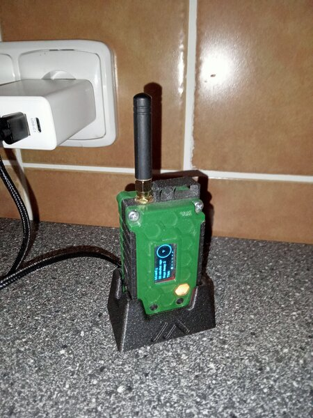
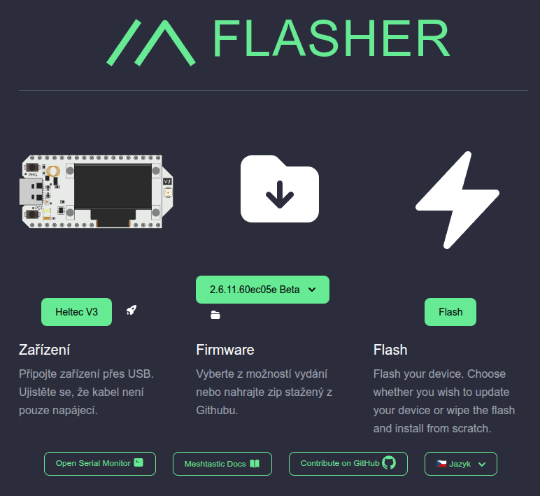
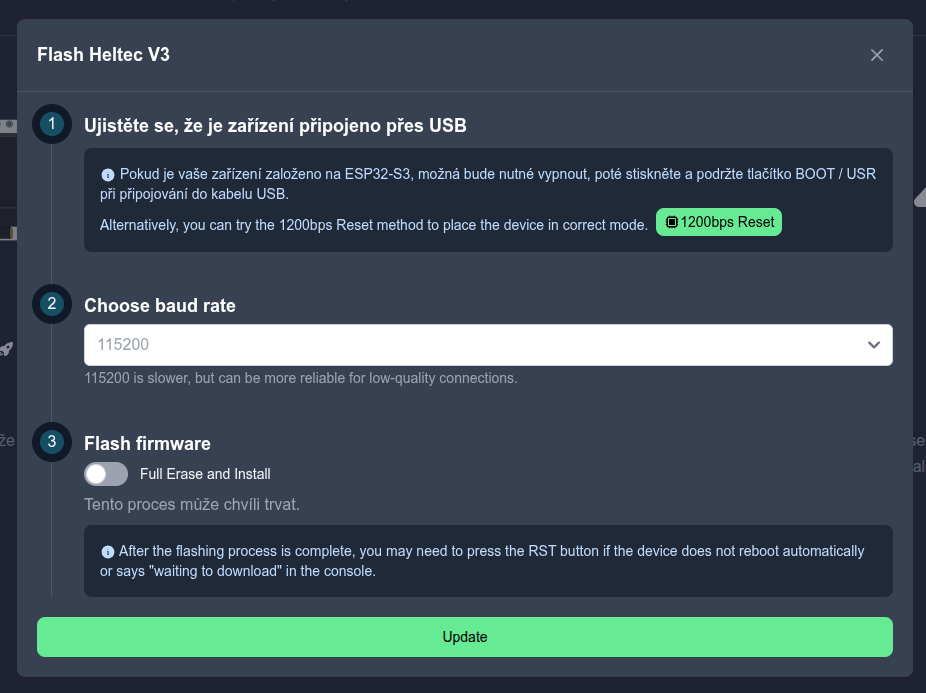

# Mobilní stanice ohM2

Mobilní stanice, nebo vysílačka, pro síť Meshtastic. Jejím základem je modul Heltec V3, který je vybaven kontrolérem ESP32, LoRa čipem, nabíjecím obvodem LiPo článku a oled displejem. Modul umí komunikovat přes LoRa, Bluetooth a WiFi.

Elektronika vysílačky je v 3D tištěném pouzdře. Jeho základem je model z [Printables]("https://www.printables.com/model/466818-heltec-v3-mini-case-for-meshtastic"). Pro svoje účely jsem na něm udělal drobné úpravy, jiná záda, snížení příliš vystupujícího okénka a zadělání výřezu pro plexi. Autor modelu má bohužel nastaveno nesdílet a nemodifikovat, takže si úpravy nechám pro sebe. Nové díly ale k dispozici dám.

Na zádech na původním modelu mi vadila špatná tisknutelnost, chybějící zámky a absence klipu na uchycení. Navíc jsem si dost oblíbil závitové vložky, které jsem tam pro snazší montáž také doplnil. Výhodou původního modelu je jeho lehkost, zvlášť ve spojení s plastovými šroubky (ty se do mosazných závitových vložek nehodí).

Model se skládá ze dvou částí. Klipu a samotného krytu. Ty se spojují lepením - ideálně modelářským vteřinovým lepidlem.


Druhá drobná úprava je spojení tlačítek tenkým páskem. Tlačítka na původním modelu jsou samostatná a proto se dost špatně krabička skládá - tlačítka snadno vypadnout. Takto spojená jsou na tom o dost lépe.


Tlačítka je vhodné vytisknout čirým filamentem, třeba basic PLA. Přes pravé tlačítko pak prosvítá kontrolka. Na svojí stanici jsem vytvořil přímo nad kontrolkou okénko. To nedoporučuju. Kontrolka je na stanici prakticky k ničemu, takže je to zbytečná práce navíc.

Všechny modely a stlka jsou v adresáři [model](model).



Pro lepší komfort užívání jsem si k vysílačce dodělal nabíjecí dok. Vždy když přijdu z výletu, hodím vysílačku zpět do doku a na příště mám zase nabito. Celou dobu jsem navíc ve spojení. V domě sice moc dobrý signál není, ale spojení mi zajišťuje pevná stanice ohM1 na střeše, za cenu jednoho hopu navíc.


Model doku se také skládá ze dvou částí. Jedna je samotný stojan, druhá je zátka, kterou se napájecí USB kabel zatěsní do stojanu. Zátka jde zasunout dobře, ale zároveň drží na místě a tím drží i kabel. Bohužel už stený kabel, ohnutý dozadu, nemůžu sehnat. ~~Takže to budu muset předělat, protože bych si chtěl pořídit ještě alespoň jeden dok do práce.~~ Takže sem to předělal, nové modely už tady jsou.

- [nabíjecí kabely z Aliexpresu](https://www.aliexpress.com/item/1005008331618829.html?spm=a2g0o.order_list.order_list_main.5.7a861802aBEhtq), které pasují do nové verze a zatím se dají objednat (než mi to zase někdo zničí).

Kromě základní funkce Meshtastic nodu je zapojení doplněné o GPS čip. To je kvůli možnosti reportovat polohu. Na displeji se pak také ukazuje vzdálenost od ostatních nodů, které mají polohu také zapnutou.

V pouzdře je také docela velký LiPo článek 2000mAh, aby, i přes žravost Heltecu, vydržela vysílačka nějaký čas bez nabíjení.

## Elektronika

- [Heltec V3 (Aliexpress)](https://www.aliexpress.com/item/1005007383620718.html?spm=a2g0o.order_list.order_list_main.171.3e601802HxDH7p)
- [LiPo článek (Aliexpress)](https://www.aliexpress.com/item/1005007850868686.html?spm=a2g0o.order_list.order_list_main.111.3e601802HxDH7p)

### Volitelně

- [GPS modul (Aliexpress)](https://www.aliexpress.com/item/32832919409.html?spm=a2g0o.order_list.order_list_main.151.3e601802HxDH7p)
- [Vypínač (Aliexpress)](https://www.aliexpress.com/item/10000003088863.html?spm=a2g0o.order_list.order_list_main.136.1b5a1802tNyZ4L)

Modul Heltec V3 je třeba vybrat správnou frekvenci 868MHz a také variantu bez krabičky a s anténou a pigtailem.

# Antény

Původní anténa dodávaná s module Heltec V3 je pěkně malá a vícemeně se mi zdála použitelná. Měl jsem ji jak na první verzi [ohM1 (pevná stanice na střeše)](../ohm1/README.md), tak na mobilní ohM2 (o které píšu tady). Na ohM1 jsem ale přesto pořídil lepší anténu. Podotýkám, že nemám žádnou možnost objektivního srovnání měřením - chtělo by to třeba NanoVNA. Vycházel jsem proto z toho, že původní krátká je prostě jen 1/8λ a 1/4λ nebo dokonce 1/2λ musí být prostě lepší. A také z doporučení na [www.czmesh.cz](https://www.czmesh.cz).

Pro statický node ohM1 jsem zatím zvolil [dlouhou pevnou anténu z alíku](https://www.aliexpress.com/item/1005006833587735.html?spm=a2g0o.order_list.order_list_main.161.4ef218025F7g4x). V objednávce přišli zrovna dvě, takže jsem to mohl zkusit i na mobilní stanici ohM2. A byl to velký rozdíl, akorát že anténa je fakt velká. Mnohem větší než vysílačka.

Jako kompromis jsem zkusil [delší prutovou ohebnou anténu, taky z alíku](https://www.aliexpress.com/item/1005004607615001.html?spm=a2g0o.order_list.order_list_main.41.4ef218025F7g4x). Ta je mnohem lehčí a navíc je ohebná. Doporučuju.

Ceny těhto antén se hrozně mění a málokdy člověk narazí něco fakt rozumného (je to přece jen drát). Celkem by mě zajímalo, čím se to řídí. Asi jak se vyspí čínský radiotelekomunikační úřad. Ale jak píšu, stojí to za to.

Abych nebyl za úplného ignoranta, i když o anténách nic nevím: Původní anténa je hustá spirála délky zhruba 1/8λ. Spirála je tak hustá, že délka drátu bude minimálně 1/2λ, možná víc, ale pak netuším proč. Tedy compact helical. Ostatní jsou variace na tohle téma, nebo přímo prutovky. Ta pevná dlouhá lomená je určitě 1/2λ, ale dovnitř nikdo nevidí. Tak pružná je z trochou fantazie zkrácena 1/2λ, za tu cenu snad i s nějakým filtrovým elementem. A nebo je tak drahá, aby si evropan myslel, že je kvalitní.

Pro pobavení, pokud někomu ty braifarty víše nestačily, bych tady ještě uvedl pěkný článek a odkaz na [HackADay](https://hackaday.com/2025/02/13/what-the-well-dressed-radio-hacker-is-wearing-this-season/), aneb jak vyrobit kravatu, která funguje jako anténa na meshtastic. Kromě krásného módního doplňku, tam pěkně dokumentuje použití NanoVNA pro skutečnou kvalifikaci antén ... No snad příště.

# Aktualizace FW

Máme tu konec června, aktuální FW Meshtastic 2.6.11. Na vysílačce ohM2 mám 2.5.15. Je tedy na čase zkusit update. Když totiž všechno funguje, je to nuda.

## 1) Záloha nastavení

Připojím vysílačku k PC, nebo něčemu co umí [Meshtastic python CLI](meshtastic.org/docs/software/python/cli). Podle návodu na webu [meshtastic.org v sekci Configuration/Radio Config/Security, úplně dole](meshtastic.org/docs/configuration/radio/security/#security-keys--backup-and-restore) - kdo by to byl tam hledal - udělám kompletní zálohu nastavení nodu. Tedy nejdůležitější jsou opravdu ty security věci, jako klíče.

```meshtastic --export-config > config_backup.yaml```

Tedy ono je nejdřív dobré se k tomu vůbec skusit připojit.

```meshtastic --info```

V tuto chvíli můžu zjitit, například, že nemám nainstalovaný meshtastic CLI (to tady popisovat nebudu). Nebo, že meshtastic CLI nemůže zařízení najít. Nebo jako já, že mám CLI starší a bylo by dobré ho zaktualizovat.

Když to nejde najít, tak CLI vypíše:

```
$ meshtastic --info
No Serial Meshtastic device detected, attempting TCP connection on localhost.
Error connecting to localhost:[Errno 111] Connection refused
```

Stačí pak obvykle zadat správný sériový port:

```
$ meshtastic --serial /dev/ttyUSB0 --info
Connected to radio

Owner: ohMesh02📟 (ohM2)

...

*** A newer version v2.6.4 is available! Consider running "pip install --upgrade meshtastic" ***
```

A hláška na konci výpisu mi říká, že je novější verze meshtastic CLI, a jak jí získat. Takže, nejdřív upgrade CLI.

```
pip install --upgrade meshtastic
```

Teď už skutečně nic nebrání záloze nastavení nodu.

```
meshtastic --serial /dev/ttyUSB0 --export-config > 20250627_ohm2_backup.yaml
```

## 2) Nahrání nového FW

Asi nejsnazší způsob je pomocí webu [Meshtastic Web Flasher](flasher.meshtastic.org). Je k tomu ale třeba nějký prohlížeč, který podporuje WEB serial. Tedy Chromium, Chrome nebo Edge.

- vyberu zařízení Heltec V3
- zvolím poslední Betu
- kliknu na Flash



V následujícím dialogu zvolím Update. Nezaškrtávám Full Flash Erase, protože mám stále naději, že to projde korektně a nebudu muset obnovovat nastavení nodu.



Následuje okno s výběrem portu:


A pak pár minut nahrávání a success dialog, tedy v lepším případě.


Pokud node funguje jak má, pamatuje si svoje jméno a nastavené kanály, je všechno v pořádku.

Poznámka: Pokud se node nechce z nějkého důvodu připojit, je dobré zkusit ho připojit a odpojit fyzicky, nebo také vypnout a zapnout tab s web flaherem. Obvykle je totiž již někde port připojený a druhé připojení není možné.

Mě se to samozřejmě nepovedlo, hlavně proto, že jsem lovil ty screenshoty a přeskakoval z jednoho okna do druhého. Poznal jsem to hned, protože po mě nod po připojení k telefonu chtěl nastavit region. Udělám tedy Full Flash Erase a obnovím nastavení nodu ze zálohy.

## 3. Obnovení nastavení ze zálohy

Pokud je třeba, a to je protože jsem to zvrtal, obnovím nastavení nodu ze zálohy, pomocí příkazu python meshtastic CLI.

```
meshtastic --serial /dev/ttyUSB0 --configure 20250627_ohm2_backup.yaml
```

Uf. Hotovo. Kanály zase mám, jméno taky, na svoje nody se dovolám, takže se nezměnily klíče. Region se tedy musel nastavit a zařízení znovu spárovat s telefonem. Jo a krátké jméno sem taky musel nastavit. No a GPS, a ještě pár drobností. To je všechno tím Full Erase. Tak jednoduché to mohlo být ... No ale teď mám alespoň návod na upgrade FW. Asi je na čase konečně vyrobit návod na kompletní nastavení nodu.

# Galerie ze stavby nodu

Stejné fotky jsou součástí [html dokumentu](../www/heltec_v3_mobile_build.html) v [adresáři www](../www). Stačí tedy stáhnout repozitář, v adresáři www spustit skript get_depend.py, který stáhne knihovnu lightbox použitou na galerii, a prohlížet i s kecama co jsem tam dopsal. Jinak taky .. bez keců.


