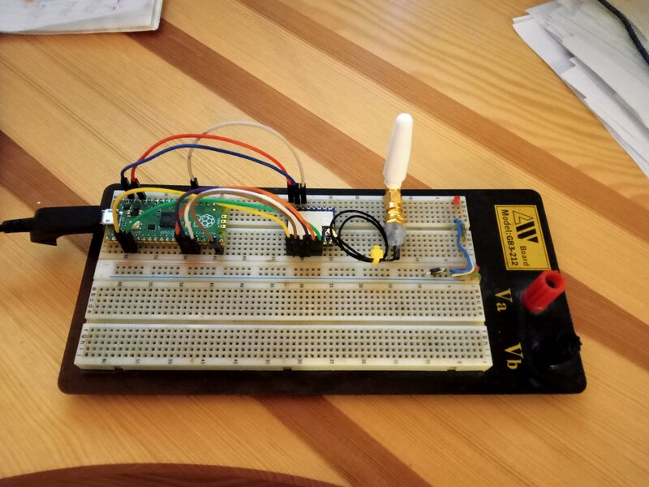
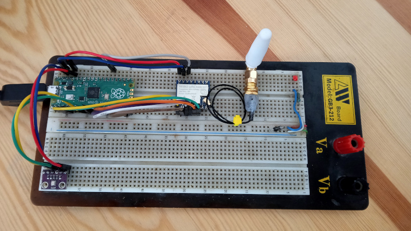
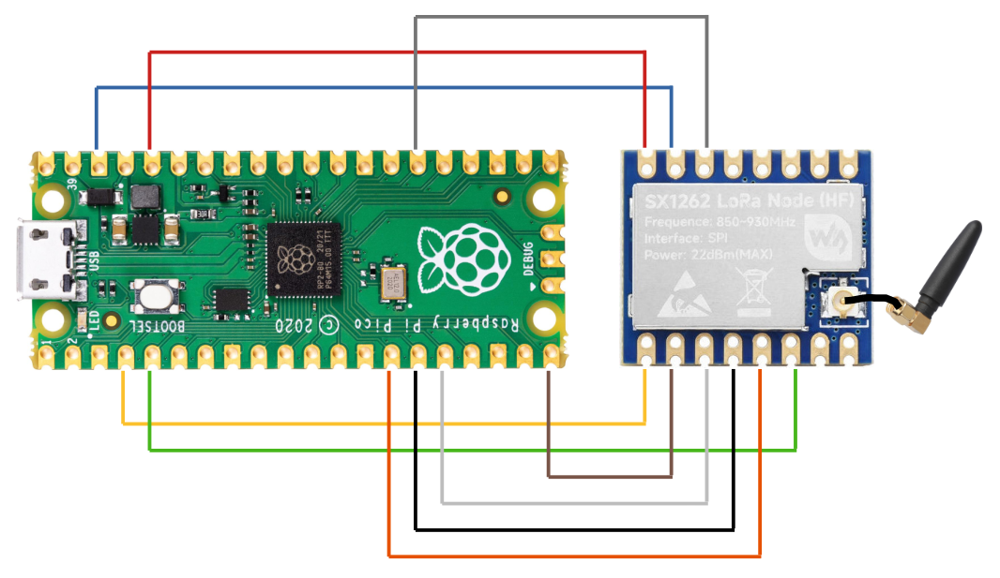
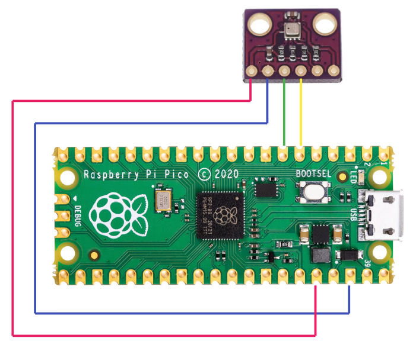
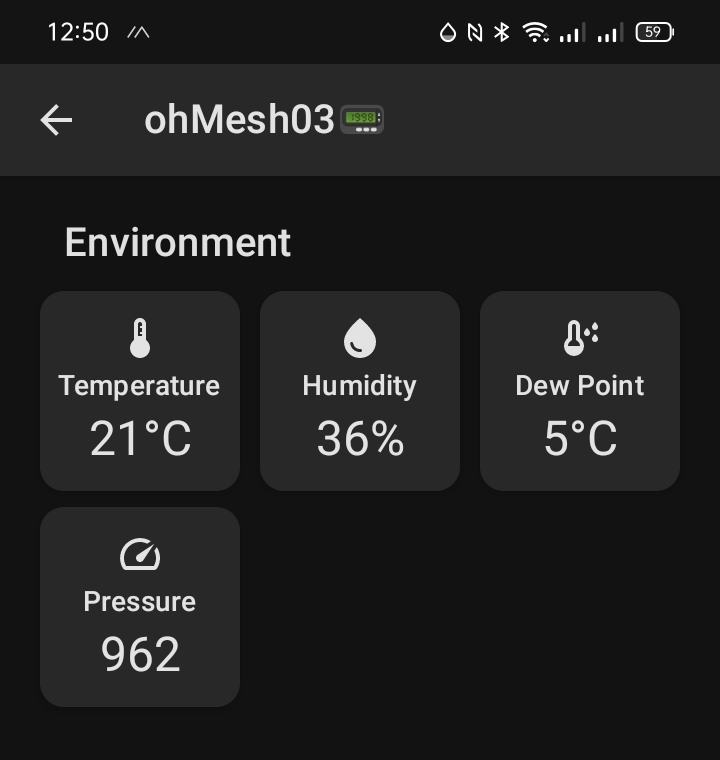
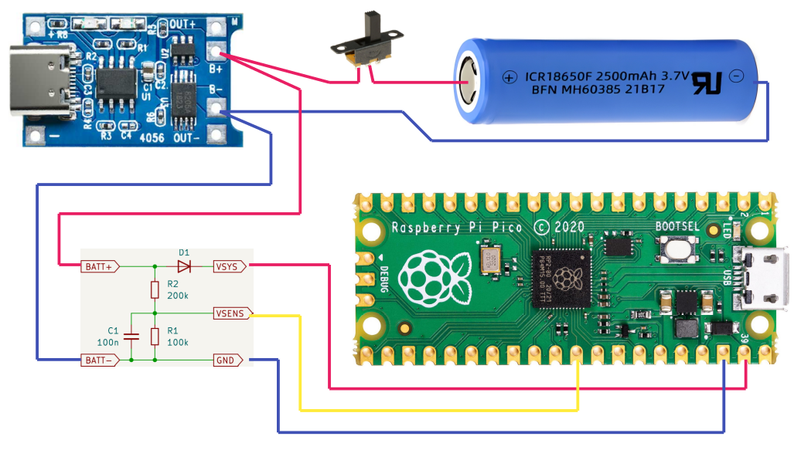
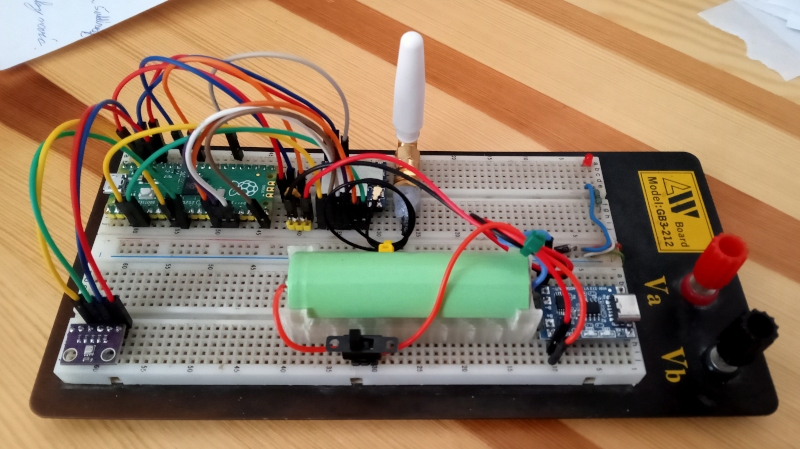
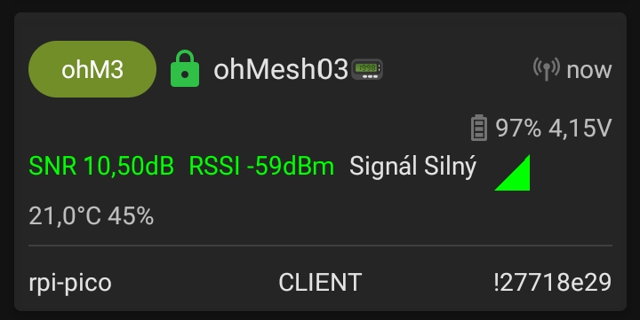

# Stanice s Raspberry PI pico ohM3

Dalším mým pokusem s Meshtastikem je stanice postavená na základě [Raspberry PI Pico s kontrolérem RP2040](https://www.raspberrypi.com/documentation/microcontrollers/pico-series.html#pico-1-family). LoRa konektivitu zde zajišťuje [modul SX1262](https://www.aliexpress.com/item/1005005868418525.html?spm=a2g0o.order_list.order_list_main.59.3e601802HxDH7p). Stanice je zatím postavená na nepájivé desce, breadboardu, takže jsem jí dal pracovní název BreadTastic Pico (ne, není to Ostravsky, bez diakritiky).



Stanici jsem později doplnil o čidlo prostředí, aby to ukazovalo nějaká pěkná čísla.



## Základní zapojení

Úplně minimální stanice s Raspberry PI Pico potřebuje ke své funkci, kromě samotného [Raspberry](https://www.raspberrypi.com/documentation/microcontrollers/pico-series.html#pico-1-family), už jen LoRa modul [SX1262](https://www.aliexpress.com/item/1005005868418525.html?spm=a2g0o.order_list.order_list_main.59.3e601802HxDH7p) a [anténu](https://www.aliexpress.com/item/32957518009.html?spm=a2g0o.order_list.order_list_main.75.19f61802j9j96w).



Pico | SX1262
--- | ---
GND | GND
3V3(OUT) | 3V3
GP2 | BUSY
GP3 | CS
GP10 | CLK
GP11 | MOSI
GP12 | MISO
GP15 | RESET
GP20 | DIO1

Zapojení vychází z [modulu SX1262 LoRa Node od WaveShare](https://www.waveshare.com/pico-lora-sx1262-868m.htm).

Pozn.: Právě jsem si všimnul, že zapojení úplně nesedí se souborem varian.h. Tam je GP2 připojené na DIO2, místo na BUSY. Nicméně to funguje ...
- [ ] zkusit zapojit podle variant.h

## Připojení čidla prostředí BME280

K původnímu zapojení jsem se nejdřív pokoušel hledat správné piny pro připojení snímačů prostředí. Vybral jsem si čidlo [BME280](https://www.aliexpress.com/item/1005004527984343.html?spm=a2g0o.order_list.order_list_main.127.19f61802j9j96w), které už mám připojené ke statické stanici ohM1. Při nákupu čidla je třeba vybrat variantu BME280 na 3V3. Prodejci často nabízejí take BMP280, které je mnohem levnější, ale neměří vlhkost. S Meshtastikem nicméně funguje také.

Zdá se, že v oficiálním FW pro Meshtastic na Raspberry PI Pico není I2C pro telemetrii podporováno. Nebo prostě nevím jak. Rozhodl jsem se tedy přistoupit úpravě FW.

Připojil jsem snímač na piny 6 a 7, kam je možné namapovat I2C1. Tyto piny jsem exlicitně uvedl ve variantě pro překlad a firmware si zkompiloval sám. Postup kompilace je uvedený na webu [meshtastic.org](https://meshtastic.org/docs/development/firmware/build/), takže uvedu jen body.

Pozn.: Výběr čidla BME280 možná nebyl ten nejšťastnější. Vybral jsem ho hlavně proto, že jsem ho měl v šuplíku, a také proto, že mám stejné čidlo připojené k statické stanici ohM1. Zdá se ale, že specificky BME280, nefunguje s Raspberry PI. Uvádí se to zde: [github meshtastic firmware issue 5361](https://github.com/meshtastic/firmware/issues/5361). Chyba je opravená ve verzi FW 2.6.+, která v době, kdy jsem to zkoušel, byla ještě alfa. Každopádně, vlastním buildem FW, se toto vyřešilo.

### Zapojení snímače



Pico | BME280
--- | ---
GND | GND
3V3(OUT) | 3V3
GP6 | SDA
GP7 | SCL

### Úprava FW aby podporoval moduly I2C

- instalace Visual Studio Code s doplňkem PlatformIO
- stažení githubového repozitáře s fimwarem
- výběr cílového zařízení rpipico
- úprava souboru variant.h, přidání I2C pinů
- kompilace a upload

#### Úprava souboru variant.h

Za poznámku o defaultních I2C pinech (4/5) jsem přidal definici pinů I2C_SDA, I2C_SCL, I2C_SDA1 a I2C_SCL1. Asi by stačilo přidat jen ty s jedničkou, ale teď mám alespoň jistotu, až budu chtít třeba přidat displej.

```code
// default I2C pins:
// SDA = 4
// SCL = 5

// Redefine I2C0 pins to avoid collision with UART1/Serial2.
#define I2C_SDA 4
#define I2C_SCL 5

// Redefine Waveshare UPS-A/B I2C_1 pins:
#define I2C_SDA1 6
#define I2C_SCL1 7

// Recommended pins for SerialModule:
// txd = 8
// rxd = 9
```

#### Upload firmwaru

Projek ve Visual Studiu předpokládá nahrávání FW pomocí debugovacího rozhraní, které ale nemám - ještě jsem ho nepotřeboval. Naštěstí se při překladu vytvoří i soubor firmware.u2f, který se nahrává do zařízení jako na flash disk. Tak jak je to ve všech návodech pro začátečníky.

### Zapnutí Telemetrie

Snímače na I2C nezačnou samy od sebe pracovat, je třeba je zapnout tzv. Modul Telemetrie. Ve webovém rozhraní [Meshtastic Web](https://client.meshtastic.org/) se mi to bohužel nedařilo, takže uvedu postup pro Meshtastick Python CLI.

```code
python3 -m meshtastic --set telemetry.environment_measurement_enabled true
```

Někdy je třeba uvést port, protože Python CLI nemůže stanici najít, ale tentokrát to vyšlo.

Takhle to pak vypadá, když takovou stanici vidí jiná stanice (tentokrát šlo o mou vysílačku ohM2).



## Připojení napájecího článku

Ve většině aplikací bude nejspíš podobný meshtastický uzel pracovat z baterie. Toto je ve firmwaru už podporováno, stačí tedy jen připojit článek s nabíjecím modulem a pár odporů jako dělič, pro snímání napětí baterie.

### Materiál

- článek 18650
- [nabíjecí modul](https://www.aliexpress.com/item/1005001688742632.html?spm=a2g0o.order_list.order_list_main.43.1a441802W3wg30)
- odpory 100k a 200k (nejlépe přesné)
- nějaký malý keramický kondenzátor
- dioda (nejlépe s malým úbytkem napětí)

### Zapojení



Do zapojení jsem také přidal diodu, kondenzátor a vypínač. Bez diody by se musel článek odpojovat, když se chceme připojit k USB na Raspberry PI. Kondenzátor je na potlačení šumu měření a vypínač se u článku vždycky hodí.

Napájecí článek je umístěný ve vytisknutém držáku ([model ve Freecadu](./model/breadboard_batery_holder.FCStd), [export pro slicer](./model/breadboard_batery_holder.3fm)). Do držáku se zespodu pájkou píchnou kolíky z pinové lišty a je z toho breadtastický držák.



### Funkce

Takhle to pak vypadá, když ten node vidíte ze sítě meshtastic. On tam ten stav baterie byl i předtím, ale ukazoval nesmysly, protože tam prostě ten článek chyběl. Nic se nenastavuje, prostě to chodí.




Pokračování příště...

# ToDo

- [x] doplnit schéma zapojení SX1262
- [x] doplnit schéma zapojení BME280
- [x] přidat baterku s nabíječkou
- [ ] přidat displej
- [ ] přidat gps přijímač
- [ ] měření spotřeby
