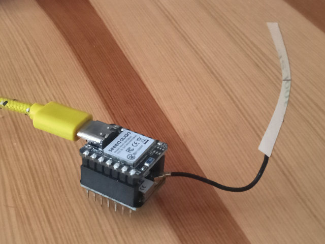
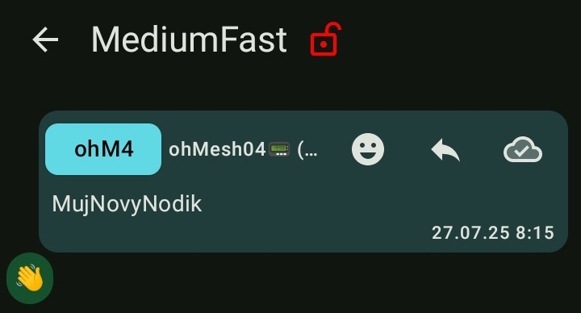
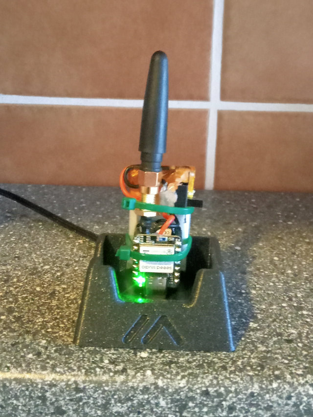
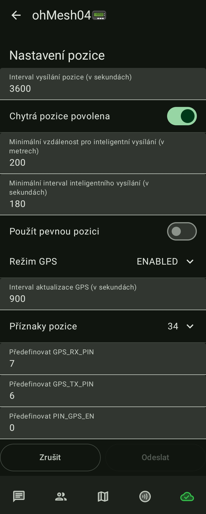

# ohMesh4📟

Stanice je založená na kitu **XIAO nRF52840 & WIO SX1262**. S využitím tohoto kitu se pokusím sestavit node, který bude náhradou žravého Heltec V3.

Kit je dodán v takovémto stavu. Stačí složit, zapojit anténu (tedy to co je dodané) a flashnout Meshtastic FW.

Pro nastavení jsem node spároval s telefonem a otevřel v aplikaci Meshtastic. Jediné nastavení, které jsem zatím dělal je samozřejmě location, bez které to nejede, krátké a dlouhé jméno nodu a pásmo (Medium Fast). Pak už jsem byl schopný vyslat svou první zprávu na primární kanál. Příjem jsem zkontroloval na jiném nodu a v zápětí dokonce dostal "mávanec" od aktivního Meshtastika - Dík. Chodí to.

Aby byl node použitelný, chce to nějakou lepší anténu a baterku. Také by to chtělo GPS (to by snad jít mělo). Displej s tímto kitem nepřipadá v úvahu, né že by byl prakticky potřeba.

Místo dodané antény jsem připojil pigtail U.LF na SMA. Z kitu jsem ostříhal dlouhé piny, aby mi neudělali díru do baterky. Baterku jsem přes vypínač připájel ke kitu XIAO nRF52840, který má vestavěný USB nabíječ LiPo článků. Za použití tafixu a stahovacích pásků jsem to celé poskládal na připájený článek,  - jde jen o zkoušku.

Moje baterka (přesněji článek) má kapacitu 500mAh. Původně jsem ji používal na node ohM2, než mi přišli články 2Ah. S Helteckem vydržela asi 2 hodiny. Node ohM4 s ním vydrží zhruba 2 dny bez napájení .. slušný. Uvidíme, co s tím udělá GPSka.

Menší potíž je nabíjení, protože XIAO nRF52840 nabíjí pouze 50mA, takže teoreticky víc jak 10 hodin.

## Připojení GPS modulu

Aby mohl node ohM4 plně nahradit můj mobilní node ohM2, musí mít GPS modul. Pokusil jsem se najít modul co nejmenší. Je to ten samý, který jsem použil při pokusech s RP2040 pico.

Modul je připojený 4mi vodiči. GND, VCC, RX a TX. Komunikace je připojená do kříze, tedy RX na XIAO nRF52840 na TX GPS modulu a RX GPS modulu na TX XIAO nRF52840.

XIAO nRF52840 | GPS NEO-M8N
--- | ---
GND | GND
VCC | VCC
P1.11 / D6 / TX | TX
P1.12 / D7 / RX | RX

Po zapojení je třeba nastavit čtení pozice. V aplikaci v Nastavení pozice přepnout Režim GPS na ENABLED a nastavit Předdefinovat GPS_RX_PIN na 7 a Předdefinovat GPS_TX_PIN na 6.

Pro úsporu energie je možné nastavit větší interval vysílání pozice, minimální vzdálenost pro chytrou pozici a delší interval aktualizace GPS. Případně také zvolit vysílané příznaky pozice.

Připojená a zapnutá GPS skutečně zkrátí výdrž baterie na zhruba 8h. To je dost, když to bez ní vydrželo 2 dny.

## ToDo

- [x] připojit a nakonfigurovat GPS
- [ ] vyrobit nebo sehnat krabičku
- [ ] sepsat materiál (odkazy)

